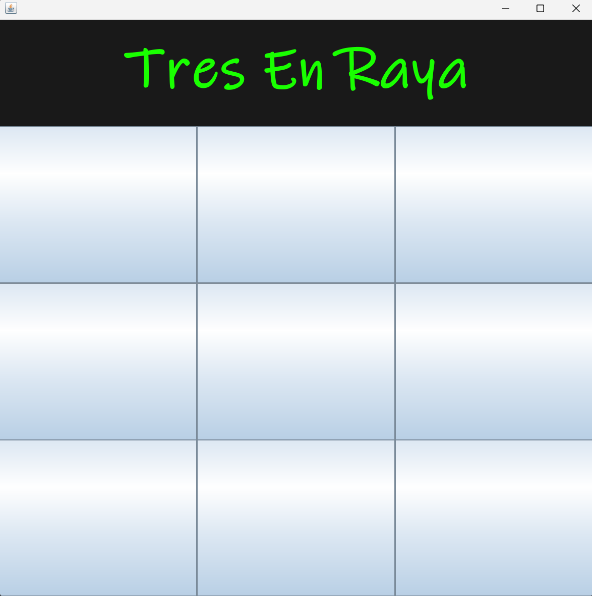
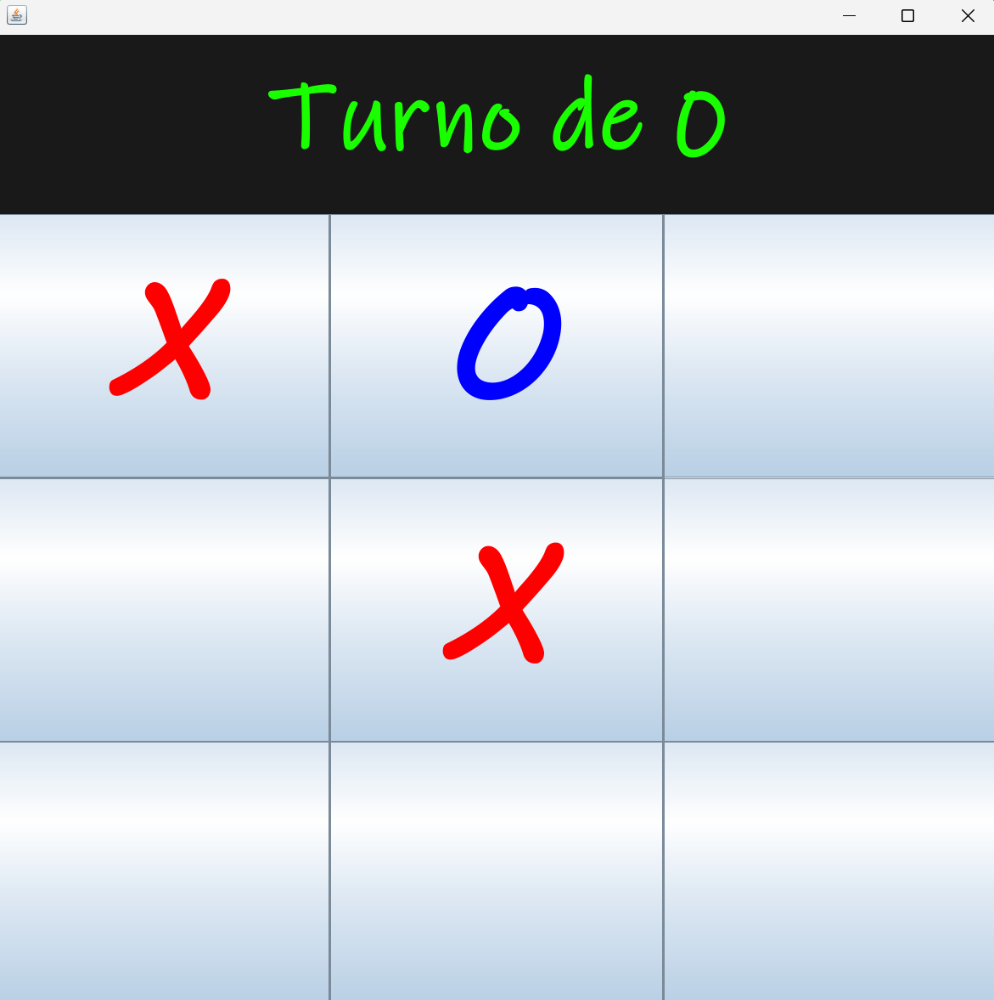
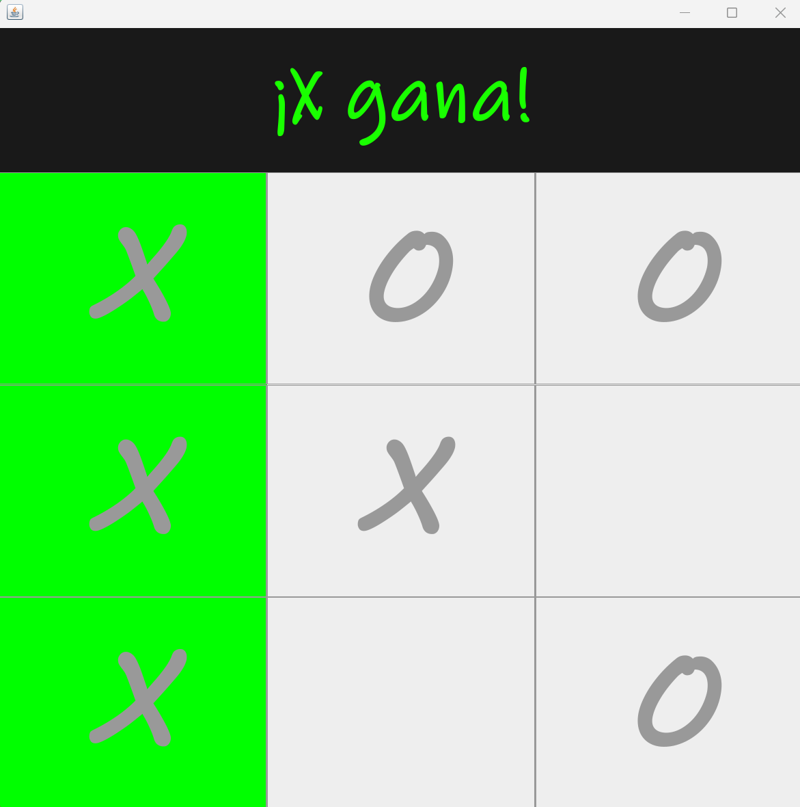

# ❌⭕ Ejercicio: Tres en Raya (Tic-Tac-Toe) con Interfaz Gráfica en Java

## 📌 Enunciado

Desarrolla una aplicación en Java que implemente el juego clásico de **Tres en Raya (Tic-Tac-Toe)** utilizando una interfaz gráfica.

El juego debe permitir que dos jugadores compitan turnándose para colocar sus símbolos (`X` y `O`) en un tablero de 3x3.

---

## 🎯 Objetivo

Practicar:

* Interfaces gráficas con **Swing**
* Gestión de eventos (`ActionListener`)
* Control de estado del juego
* Lógica de validación de condiciones de victoria

---

## 🧩 Requisitos

### 🪟 Interfaz gráfica

* Crear una ventana principal (`JFrame`)
* Mostrar un tablero de 3x3 usando botones (`JButton`)
* Incluir un área de texto (`JLabel`) que indique:

  * Turno actual
  * Resultado del juego

---

### 🔄 Mecánica del juego

* Dos jugadores: `X` y `O`
* Los jugadores se turnan automáticamente
* Cada casilla solo puede usarse una vez
* Mostrar el símbolo correspondiente en cada botón

---

### 🎲 Turno inicial

* El jugador inicial debe elegirse aleatoriamente

---

### 🧠 Lógica del juego

El programa debe:

* Detectar cuándo un jugador gana
* Comprobar todas las combinaciones posibles:

  * Filas
  * Columnas
  * Diagonales
* Detener el juego cuando haya un ganador

---

### 🎉 Resultado

* Mostrar un mensaje indicando el ganador (`X` u `O`)
* Resaltar la combinación ganadora
* Bloquear el tablero una vez finalizado el juego

---

## ⚠️ Restricciones

* No permitir sobrescribir casillas ya usadas
* No permitir seguir jugando tras una victoria
* Evitar errores de ejecución

---

## 🧠 Pistas

* Usa un array de botones (`JButton[]`) para representar el tablero
* Implementa `ActionListener` para detectar clics
* Usa un boolean para controlar el turno
* Puedes usar colores para diferenciar jugadores

---

## 🚀 Extra (opcional)

* Detectar empate (tablero lleno sin ganador)
* Añadir botón de reinicio
* Mejorar diseño visual (colores, fuentes…)
* Separar lógica del juego y la interfaz gráfica

---

## ✅ Objetivo final

Construir un juego completamente funcional con interfaz gráfica que gestione turnos, valide resultados y proporcione una experiencia interactiva.

---

## 🧪 Bonus

Intenta rehacer el juego sin mirar el código original una vez lo hayas terminado.

## 📸 Capturas

